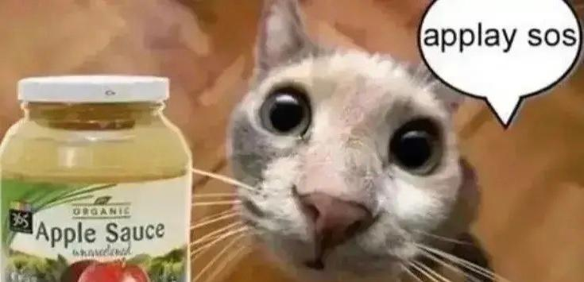

# Matthew Brownrigg's CSE 15L Lab Report 😎

**Hello! ヾ(•ω•)o** 

I'm Matt and this is a blog about my labs in *CSE 15L Software Tools and Techniques*! 

>Me fr:



I am aware of programming in `Java` and `Python`:

---
```
// Java
public static void main(String[] args) {
    System.out.println("Hello World!");
}

# Python
print("Hello World")
```

## Labs
- [Lab 1 - Markdown, URLs, Paths, and the Filesystem](https://thinkr3.github.io/cse15l-lab-reports/lab1/lab1.html) 
- [Lab 2 - Servers and Bugs](https://thinkr3.github.io/cse15l-lab-reports/lab2/lab2.html) 
- [Lab 3 - More about Less](https://thinkr3.github.io/cse15l-lab-reports/lab3/lab3.html) 
- [Lab 4 - Vim Keypress Race](https://thinkr3.github.io/cse15l-lab-reports/lab4/lab4.html) 
