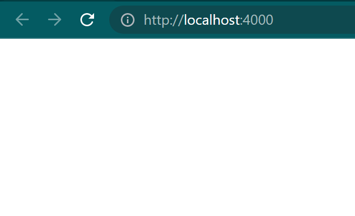
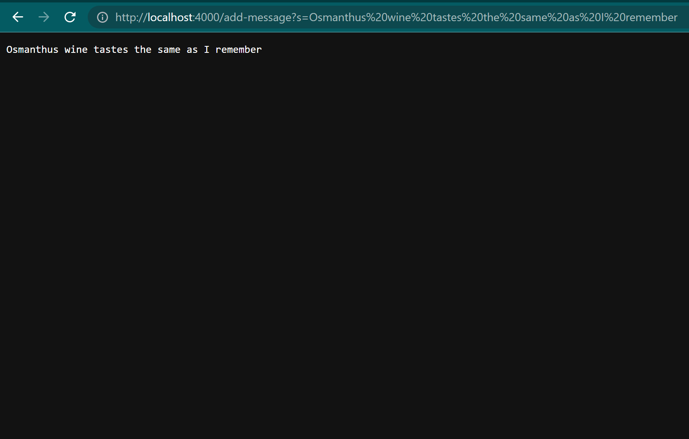
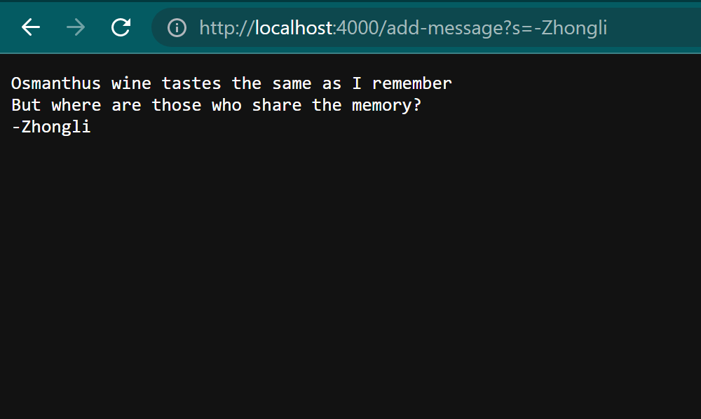
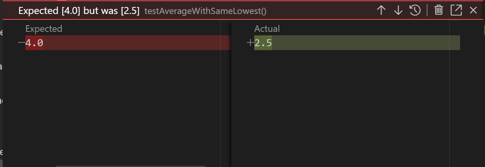
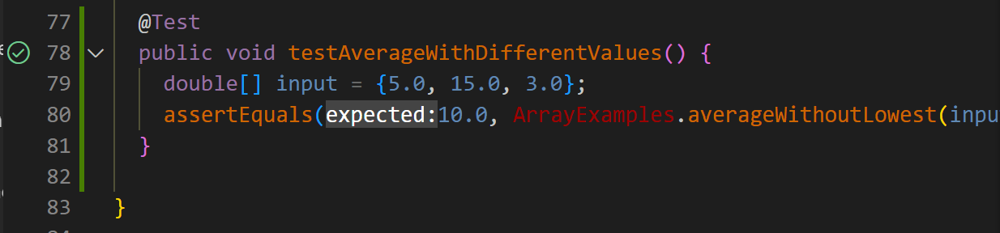
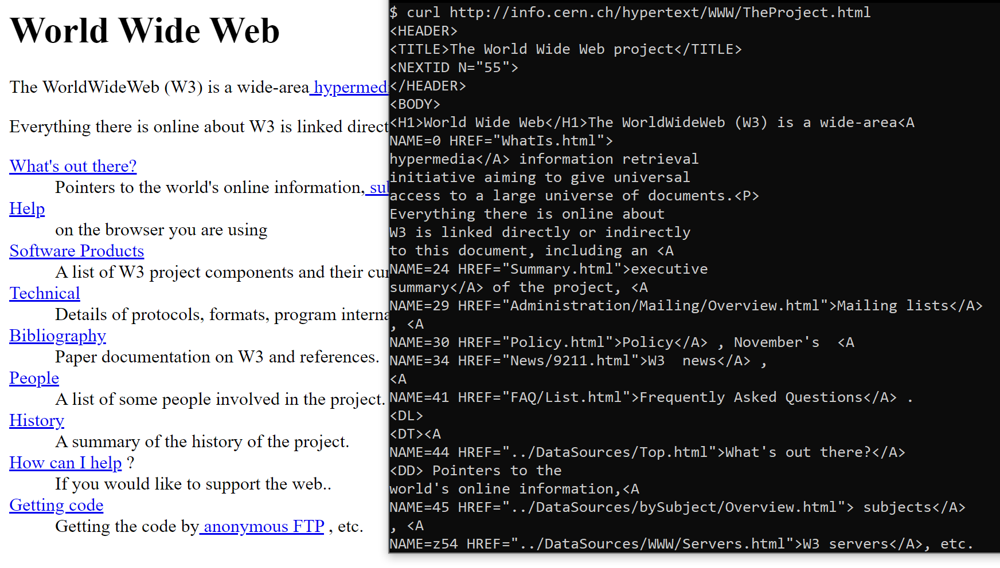

# Lab 2 - Servers and Bugs 🐛
## Overview
1. [Small Wide Web Server Setup 🕸](https://thinkr3.github.io/cse15l-lab-reports/lab2/lab2.html#part-1-small-wide-web-server-setup-)
2. [Bugs and Critters 🐜](https://thinkr3.github.io/cse15l-lab-reports/lab2/lab2.html#part-2-bugs-and-critters-)
3. [Tips and Tricks 🎯](https://thinkr3.github.io/cse15l-lab-reports/lab2/lab2.html#part-3-tips-and-tricks-)

## Part 1: Small Wide Web Server Setup 🕸

Here's a simple way to create a java web server and have it display text on screen.

### Server.java 📝

```
// A simple web server using Java's built-in HttpServer

// Examples from https://dzone.com/articles/simple-http-server-in-java were useful references

import java.io.IOException;
import java.io.OutputStream;
import java.net.InetSocketAddress;
import java.net.URI;

import com.sun.net.httpserver.HttpExchange;
import com.sun.net.httpserver.HttpHandler;
import com.sun.net.httpserver.HttpServer;

interface URLHandler {
    String handleRequest(URI url);
}

class ServerHttpHandler implements HttpHandler {
    URLHandler handler;
    ServerHttpHandler(URLHandler handler) {
    this.handler = handler;
    }
    public void handle(final HttpExchange exchange) throws IOException {
        // form return body after being handled by program
        try {
            String ret = handler.handleRequest(exchange.getRequestURI());
            // form the return string and write it on the browser
            exchange.sendResponseHeaders(200, ret.getBytes().length);
            OutputStream os = exchange.getResponseBody();
            os.write(ret.getBytes());
            os.close();
        } catch(Exception e) {
            String response = e.toString();
            exchange.sendResponseHeaders(500, response.getBytes().length);
            OutputStream os = exchange.getResponseBody();
            os.write(response.getBytes());
            os.close();
        }
    }
}

public class Server {
    public static void start(int port, URLHandler handler) throws IOException {
        HttpServer server = HttpServer.create(new InetSocketAddress(port), 0);

        //create request entrypoint
        server.createContext("/", new ServerHttpHandler(handler));

        //start the server
        server.start();
        System.out.println("Server Started! Visit http://localhost:" + port + " to visit.");
    }
}
```

### StringServer.java 📝

```
import java.io.IOException;
import java.net.URI;

class Handler implements URLHandler {
    // The one bit of state on the server: a String that will be manipulated by
    // various requests.
    String content = "";

    public String handleRequest(URI url) {
        if (url.getPath().equals("/")) {
            return String.format("%s", content);
        } else if (url.getPath().equals("/add-message")) {
            String[] parameters = url.getQuery().split("=");
                if (parameters[0].equals("s")) {
                    content += parameters[1] + "\n";
                    return String.format("%s", content);
                }
        }
        return "404 Not Found!";
    }
}

class StringServer {
    public static void main(String[] args) throws IOException {
        if(args.length == 0){
            System.out.println("Missing port number! Try any number between 1024 to 49151");
            return;
        }

        int port = Integer.parseInt(args[0]);

        Server.start(port, new Handler());
    }
}
```

### String Server Example 🧪
#### Blank Start Image ⬜
- Initialization
    - A String `contents` is initilized and will be kept in memoery as long as the server is active.
    - Nothing was called in this image I just called the standard homepage `http://localhost:4000`
- Which methods in your code are called?
    - When the page is loaded with that URL, `handleRequest(URI url)` is called.
    - `url.getPath()` is used to read the URL in a string format.
    - `.equals()` is used in the if statements to compare the contents of the URL to related functions in the program like `/add-message`.
    - `String.format()` is optional here but it is helpful to add as it formats any data inputed into the query as a string.
- What are the relevant arguments to those methods, and the values of any relevant fields of the class?
    - An if statement is called that checks the arguments in the URL path.
    - The first path checks if the path only has a `/` (This is true because blank paths have an implcit `/`)
    - This if branch returns the String variable `content`.
- How do the values of any relevant fields of the class change from this specific request? If no values got changed, explain why.
    - No values where changed in this example call because no queries were added to the path.
- 

#### Input Image 📜
- Initialization
    - Using this query `http://localhost:4000/add-message?s=Osmanthus%20wine%20tastes%20the%20same%20as%20I%20remember` I was able to append `Osmanthus wine tastes the same as I remember` to my current output stored on the webpage.
- Which methods in your code are called?
    - When the page is loaded with that URL, `handleRequest(URI url)` is called.
    - `getPath()` is used to read the URL in a string format.
    - `.equals()` is used in the if statements to compare the contents of the URL to related functions in the program like `/add-message`.
    - `getQuery()` is used to find the `?` in the path and read everything after the `?`.
    - `.split` is used to parse through the content so only the specific message is added to `content`.
    - `String.format()` is optional here but it is helpful to add as it formats any data inputed into the query as a string.

- What are the relevant arguments to those methods, and the values of any relevant fields of the class?
    - An if statement is called that parses the content after the domain.
    - The first branch in the if statement checks if the path only has a `/` (This is false) ❌
    - The second branch in the if statement checks if the path has `/add-message` (This is true) ✅
    - Then the branch gets the query using `getQuery()` and parses the content to find the intended user input.
    - This if branch concludes with appending `"Osmanthus wine tastes the same as I remember \n"` to the `content` variable. The `"\n"` is very important because it allows us to append more lines with `/add-message`.
- How do the values of any relevant fields of the class change from this specific request? If no values got changed, explain why.
    - The empty string (`""`) in the `content` variable was appended with `"Osmanthus wine tastes the same as I remember \n"`.
- 

#### Finished Image 🖼
Here's an example of what this program can do **d=====(￣▽￣)b** !
- 

## Part 2: Bugs and Critters 🐜
### Explanations
- A failure-inducing input for the buggy program, as a JUnit test and any associated code (write it as a code block in Markdown)
    ```
    import static org.junit.Assert.*;
    import org.junit.*;

    public class ArrayTests {
        @Test 
        public void testAverageWithSameLowest() {
            double[] input = {5.0, 3.0, 3.0};
            assertEquals(4.0, ArrayExamples.averageWithoutLowest(input), 1);
        }
    }
    ```
- An input that doesn’t induce a failure, as a JUnit test and any associated code (write it as a code block in Markdown)
    ```
    import static org.junit.Assert.*;
    import org.junit.*;

    public class ArrayTests {
        @Test 
        public void testAverageWithDifferentValues() {
            double[] input = {5.0, 15.0, 3.0};
            assertEquals(10.0, ArrayExamples.averageWithoutLowest(input), 1);
        }
    }
    ```
- The symptom, as the output of running the tests (provide it as a screenshot of running JUnit with at least the two inputs above)
    - The buggy program's symptom is an incorrect average calculation. 
    - **Buggy**
    - 
    - **Non Failure**
    - 
- The bug, as the before-and-after code change required to fix it (as two code blocks in Markdown)
    - **Buggy Code**
        ```
        public class ArrayExamples {
            static double averageWithoutLowest(double[] arr) {
                if(arr.length < 2) { return 0.0; }
                double lowest = arr[0];
                for(double num: arr) {
                    if(num < lowest) { lowest = num; }
                }
            
                double sum = 0;
                for(double num: arr) {
                    if(num != lowest) { sum += num; }
                }
                return sum / (arr.length - 1);
            }
        }
        ```
    - **The Fix**
        ```
        public class ArrayExamples {
            static double averageWithoutLowest(double[] arr) {
                if(arr.length < 2) { return 0.0; }
                int lowest = 0;
                for(int i = 0; i < arr.length; i++) {
                    if(num < lowest) { lowest = i; }
                }
            
                double sum = 0;
                for(int i = 0; i < arr.length; i++) {
                    if(i == lowest) { continue; }
                    sum += num;
                }
                return sum / (arr.length - 1);
            }
        }
        ```
- Briefly describe why the fix addresses the issue.
    - This fix replaces lowest with an index instead of the lowest value to prevent duplicates being ignored. This means that the foreach loops were also replaced with indexed for loops to keep track of the lowest value's index. There if statement was also replaced to measure when the for loop reaches the lowest value and promptly skips that index. This fix should allow us to remove the lowest value but not remove duplicate values.

## Part 3: Tips and Tricks 🎯
- You can `cat` webpages by just using `curl`!
    - 
- You can clone remotely by using:
    - `git clone <your-repository-url-for-your-fork>`
- Starting a web server in Java is easy just consult [Part 1](https://thinkr3.github.io/cse15l-lab-reports/lab2/lab2.html#part-1-small-wide-web-server-setup-)!
- To build a Java project in terminal you have to the classpath command `-cp`
    - `$ javac -cp ".;lib/hamcrest-core-1.3.jar;lib/junit-4.13.2.jar" *.java`
    - `java -cp ".;lib/junit-4.13.2.jar;lib/hamcrest-core-1.3.jar" org.junit.runner.JUnitCore ArrayTests`
- The `*` icon allows mutiple all files in the directory to be called.
    - It's called a *glob*, *wildcard*, or *pattern*!
