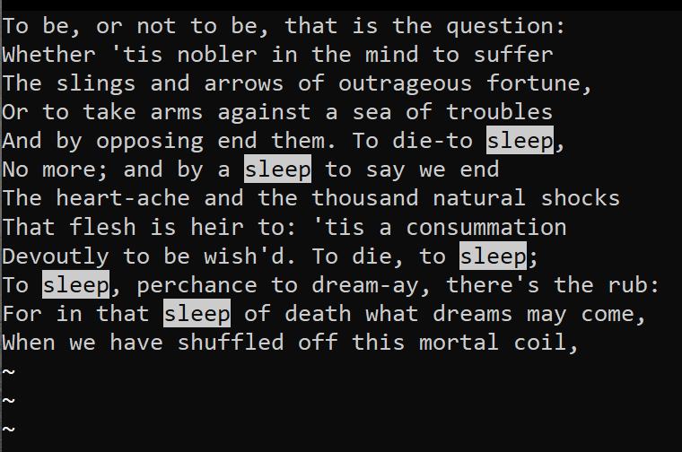
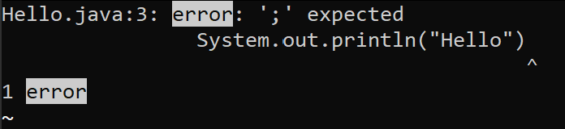

# Lab 3 - More about Less 💸

## Interesting Command Line Arguments for `less` 📚 ##

- `-N` adds line numbers to each line so you can keep track of where you are in your file!
    - This can be very helpful for you impromptu poetry sessions on your remote server
        - `less -N hamlet.txt`
        ``` 
        1 To be, or not to be, that is the question:
        2 Whether 'tis nobler in the mind to suffer
        3 The slings and arrows of outrageous fortune,
        4 Or to take arms against a sea of troubles
        5 And by opposing end them. To die-to sleep,
        6 No more; and by a sleep to say we end
        7 The heart-ache and the thousand natural shocks
        8 That flesh is heir to: 'tis a consummation
        9 Devoutly to be wish'd. To die, to sleep;
        10 To sleep, perchance to dream-ay, there's the rub:
        11 For in that sleep of death what dreams may come,
        12 When we have shuffled off this mortal coil...
        hamlet.txt (END)
        ```
    - You could also use this to debug code files. This allows you to find an error on a specific line number. 
        - `less -N Hello.java`
        ```
        1 class Hello {
        2         public static void main(String[] args) {
        3                 System.out.println("Hello")
        4         }
        5 }
        Hello.java (END)
        ```
        - No semicolon on line 3!!! **(╯‵□′)╯︵┻━┻**
- `/` can help you find occurences of words while you are "lessing" a document!
    - You can use this to find repeated words in text files!
        - `less hamlet.txt` then while in the less screen `/sleep`
        - 
        - I had to paste an image because highlights cannot appear on code blocks :/
    - You can also make your debuging life easier by finding specific errors.
        - `javac Hello.java 2> error.txt || less error.txt` then while in less `/error`
        - 
        - Note: I used `||` because the first line exits with an error code, if this code succeeded I would've used `&&`. I would also change `2>` to `>`. Anyways, SEMICOLONS!!! **╰（‵□′）╯**

    

