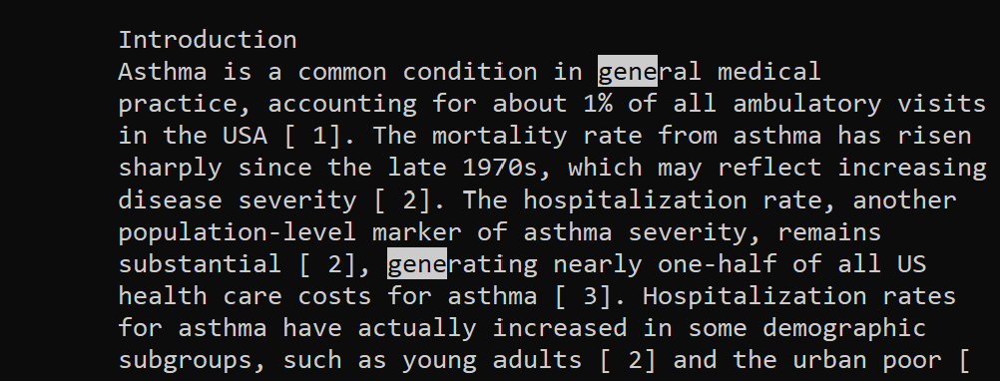
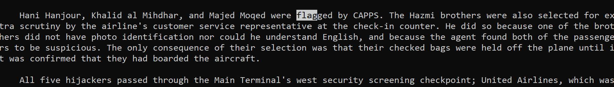

# Lab 3 - More about Less 💸

## Overview
1. [Line Number `-N` Poetry 🔢](https://thinkr3.github.io/cse15l-lab-reports/lab3/lab3.html#line-number--n-poetry-)
2. [Search Pattern `/` Sleuthing 🔎](https://thinkr3.github.io/cse15l-lab-reports/lab3/lab3.html#search-pattern--sleuthing-)
3. [Real-time `+F` Chicanery ⏱](https://thinkr3.github.io/cse15l-lab-reports/lab3/lab3.html#real-time-f-chicanery-)
4. [Editing Files `v` Final Boss 😈](https://thinkr3.github.io/cse15l-lab-reports/lab3/lab3.html#line-number--n-poetry-)

## Interesting Command Line Arguments for `less` 📚 ##
Note to grader: I got a little to distracted and now have 2 of my own examples alongside the 2 actual required examples.
<figure class="wp-block-table is-style-stripes"><table class="has-fixed-layout"><thead><tr><th><strong>Shortcuts</strong></th><th><strong>Action</strong></th></tr></thead><tbody><tr><td><strong>Down Arrow, Enter, e, j</strong></td><td>One <strong>line</strong> forward.</td></tr><tr><td><strong>Up Arrow, y, k</strong></td><td>One <strong>line</strong> backward.</td></tr><tr><td><strong>Space bar, Page Down</strong></td><td>One <strong>page</strong> forward.</td></tr><tr><td><strong>Page Up, b</strong></td><td>One <strong>page </strong>backward.</td></tr><tr><td><strong>Right Arrow</strong></td><td>Scroll <strong>right</strong>.</td></tr><tr><td><strong>Left Arrow</strong></td><td>Scroll <strong>left</strong>.</td></tr><tr><td><strong>Home, g</strong></td><td>Jump to the <strong>beginning</strong> of the file.</td></tr><tr><td><strong>End, G</strong></td><td>Jump to the <strong>end</strong> of the file.</td></tr><tr><td><strong>/[string]</strong></td><td>Search <strong>forward</strong> for the specified string.</td></tr><tr><td><strong>?[string]</strong></td><td>Search <strong>backward</strong> for the specified string.</td></tr><tr><td><strong>n</strong></td><td><strong>Next</strong> match during a search.</td></tr><tr><td><strong>N</strong></td><td><strong>Previous</strong> match during a search.</td></tr><tr><td><strong>q</strong></td><td>Quit <strong>less</strong>.</td></tr></tbody></table></figure>

## Line Number `-N` Poetry 🔢 ##

- `-N` adds line numbers to each line so you can keep track of where you are in your file!
    - This can be very helpful for your impromptu poetry sessions on your remote server
        - `less -N hamlet.txt`
        ``` 
        1 To be, or not to be, that is the question:
        2 Whether 'tis nobler in the mind to suffer
        3 The slings and arrows of outrageous fortune,
        4 Or to take arms against a sea of troubles
        5 And by opposing end them. To die-to sleep,
        6 No more; and by a sleep to say we end
        7 The heart-ache and the thousand natural shocks
        8 That flesh is heir to: 'tis a consummation
        9 Devoutly to be wish'd. To die, to sleep;
        10 To sleep, perchance to dream-ay, there's the rub:
        11 For in that sleep of death what dreams may come,
        12 When we have shuffled off this mortal coil...
        hamlet.txt (END)
        ```
    - You could also use this to debug code files. This allows you to find an error on a specific line number. 
        - `less -N Hello.java`
        ```
        1 class Hello {
        2         public static void main(String[] args) {
        3                 System.out.println("Hello")
        4         }
        5 }
        Hello.java (END)
        ```
        - No semicolon on line 3!!! **(╯‵□′)╯︵┻━┻**
    - This also works on *really* long files so you don't get lost reading them. 😴
        - `less -N ./technical/911report/preface.txt`
        ```
        1
        2
        3
        4             PREFACE
        5             We present the narrative of this report and the recommendations that flow from it to
        6                 the President of the United States, the United States Congress, and the American
        7                 people for their consideration. Ten Commissioners-five Republicans and five
        8                 Democrats chosen by elected leaders from our nation's capital at a time of great
        9                 partisan division-have come together to present this report without dissent.
        ...
        103               considered the views of others. We hope our report will encourage our fellow
        104               citizens to study, reflect-and act.
        105             Thomas H. Kean, chair
        106             Lee H. Hamilton, vice chair
        107
        108
        (END)
        ```
        - Another example:
        - `less -N ./technical/government/Media/Philly_Lawyers.txt`
        ```
        1
        2
        3
        4
        5 Business Wire
        6
        7 Philly Lawyers Lead in Pro Bono But Need to Do More
        8 Friday, June 28, 2002
        9 PHILADELPHIA--(BUSINESS WIRE)--June 29, 2002--Philadelphia
        10 lawyers have reason to be proud of their collective "commitment to
        11 make legal services available to the poor and needy" in the region
        12 but the "justice system still remains closed to many" and much more
        13 needs to be done.
        ...
        82 commitment that we can and will uphold. The journey along this path
        83 begins today " he concluded.
        84
        85
        86
        87
        (END)
        ```
        - I cut some parts of this file because it's long...
- Source: [linuxize.com/post/less-command-in-linux/](https://linuxize.com/post/less-command-in-linux/)


## Search Pattern `/` Sleuthing 🔎 ##

- `/` can help you find occurences of words while you are "lessing" a document! (Using `-p<pattern>` also works!)
- Use `p` to look at previous occurences and `n` to look at the next occurence.
    - You can use this to find repeated words in text files!
        - `less hamlet.txt` then while in the less screen `/sleep`
        - 
        - I had to paste an image because highlights cannot appear on code blocks :/
    - You can also make your debuging life easier by finding specific errors.
        - `javac Hello.java 2> error.txt || less error.txt` then while in less `/error`
        - 
        - Note: I used `||` because the first line exits with an error code, if this code succeeded I would've used `&&`. I would also change `2>` to `>`. Anyways, SEMICOLONS!!! **╰（‵□′）╯**
    - Use this to search *looong* documents for the important bits. 🍬
        - `less -pgene ./technical/biomed/rr37.txt`
        - 
        - `less ./technical/911report/chapter-1.txt` then `/flag`
        - 
- Source: [phoenixnap.com/kb/less-command-in-linux](https://phoenixnap.com/kb/less-command-in-linux)

## Real-time `+F` Chicanery ⏱ ##

- `+F` can help you see your file update in real-time!
    - This can be used to keep an up to date log file to measure changes in real time, git!
        - `less +F updates.txt` is empty until I start making changes
        ```
        Waiting for data... (interrupt to abort)
        ```

        - When I make my first few changes the less screen will update!
        
            ```
            Ver 0.1
            Added a hello world program!

            Ver 0.2
            Added a semicolon to make hello world actually run...
            Waiting for data... (interrupt to abort)
            ```

    - I use this one to check my stock options while programming on a terminal 😎
        - `less +F stocks.txt` will show
        ```
        Apple Inc. $173.60
        Microsoft. $312.31
        Amazon. $110.19
        Waiting for data... (interrupt to abort)
        ```
        - But if I buy stocks in Circuit City my stocks.txt will update automatically!
        ```
        Apple Inc. $173.60
        Microsoft. $312.31
        Amazon. $110.19
        Circuit City. $0.01
        Waiting for data... (interrupt to abort)
        ```
        - Note it may take a second line input for the first line input to be updated. Also note that this cannot edit previous lines.
    - This could allow you to add addendums to files and view their changes in real time! Now we can wait for 20+ old files to be updated 😎.
        - `less +F ./technical/government/Media/Philly_Lawyers.txt`
        
            ```
            ... # (Omitted 100 lines for brevity)
            commitment to those who need but cannot afford legal services. That
            is a commitment that we are duty-bound to honor and it is a
            commitment that we can and will uphold. The journey along this path
            begins today " he concluded.

            Waiting for data... (interrupt to abort)
            ```

        - `less +F ./technical/911report/preface.txt` if we wait long enough they might update this book...
        
            ```
                this process with strong opinions about what would work. All of us have had to
                        pause, reflect, and sometimes change our minds as we studied these problems and
                        considered the views of others. We hope our report will encourage our fellow
                        citizens to study, reflect-and act.
                Thomas H. Kean, chair
                Lee H. Hamilton, vice chair

            Waiting for data... (interrupt to abort)
            ```

- Source: [ChatGPT](https://chat.openai.com/)


## Editing Files `v` Final Boss 😈 ##

- Although less is read-only, pressing `v` while in less opens Vim.
- Press `s` while in Vim to start editting.
- To exit Vim use `Esc` + `:wq!` to save changes or `Esc` + `:qa!` to save without changes.
    - Now I can fix that pesky semicolon in my hello program on a remote computer
        - `less Hello.java` then press `v`
        ```
        class Hello {
            public static void main(String[] args) {
                System.out.println("Hello");
            }
        }
        Hello.java [dos] (20:37 10/05/2023)
        "Hello.java" [noeol][dos] 5L, 94B
        ```
        - Note: omitted `~` which are used to fill up the rest of the screen
        - Added the semicolon!!!
    - I can also update my stock portfolio with the proper values now
        - `less stocks.txt` then press `v`
        ```
        Apple Inc. $403.60
        Microsoft. $312.31
        Amazon. $110.19
        Circuit City. <BANKRUPT>
        Dogecoin. $0.08
        stocks.txt [dos] (21:43 10/0 2023)
        "stocks.txt" [dos] 5L, 100B
        ```
    - We can now edit the ./technical files remotely 🎉!
        - `less ./technical/government/Media/Philly_Lawyers.txt` then `v`
        
            ```
            ... # (Omitted 100 lines for brevity)
            is a commitment that we are duty-bound to honor and it is a
            commitment that we can and will uphold. The journey along this path
            begins today " he concluded.

            Just vandalized this file ~_~

            (END)
            ```

        - `less technical/biomed/1471-2490-3-2.txt` then `v`
        - Deleted everything except the first 5 lines
        
            ```
            Background
            The application of UHCT for the diagnosis of acute
            ureteric colic has positively influenced the practice of
            urology and uro-radiology. The technology allows the rapid
            and accurate determination of the presence of stone in the
            (END)
            ```

- Learn more [linuxhandbook.com/less-command](https://linuxhandbook.com/less-command/)
- How to exit Vim: [stackoverflow.com/questions/11828270/how-do-i-exit-vim](https://stackoverflow.com/questions/11828270/how-do-i-exit-vim)
    - Spent too long just trying to quit Vim. (T_T)


    

