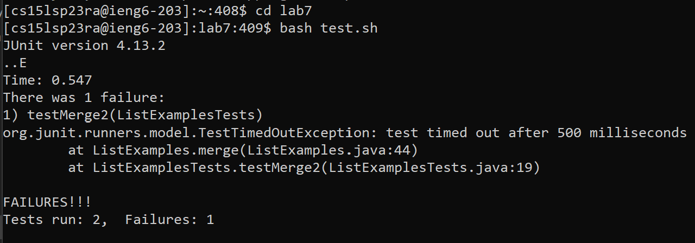

# Lab 4 - Vim Keypress Race 🏁

## Overview
### Speedrun Setups 📐
1. Setup Delete any existing forks of the repository you have on your account
2. Setup Fork the repository
3. We're reading to go!

### Racing Checkpoints 🏁
1. [**Log**](https://thinkr3.github.io/cse15l-lab-reports/lab4/lab4.html#step-1-hacking-in-) into ieng6
2. [**Clone**](https://thinkr3.github.io/cse15l-lab-reports/lab4/lab4.html#step-2-cloning-) your fork of the repository from your Github account
3. [**Run**](https://thinkr3.github.io/cse15l-lab-reports/lab4/lab4.html#step-3-running-tests-%EF%B8%8F) the tests, demonstrating that they fail
4. [**Edit**](https://thinkr3.github.io/cse15l-lab-reports/lab4/lab4.html#step-4-post-test-edits-) the code file to fix the failing test
5. [**Run**](https://thinkr3.github.io/cse15l-lab-reports/lab4/lab4.html#step-5-re-running-tests-%EF%B8%8F%EF%B8%8F) the tests, demonstrating that they now succeed
6. [**Commit**](https://thinkr3.github.io/cse15l-lab-reports/lab4/lab4.html#step-6-commit-and-launch-) and push the resulting change to your Github account (you can pick any commit message!)

## Step 1: Hacking in 👨‍💻
**Keypresses:** `s` `s` `h` `<Space>` `c` `s` `1` `5` `l` `s` `p` `2` `3` `r` `a` `@` `i` `e` `n` `g` `6` `.` `u` `c` `s` `d` `.` `e` `d` `u` `<Enter>`
- *Note*: since we have a ssh key for ieng6 there's no need to type in my password. Avert your prying eyes! 👀

- Hacked in!
    - 

## Step 2: Cloning 🧪
**Keypresses:** `g` `i` `t` `<Space>` `c` `l` `o` `n` `e` `<right-click>` `<Enter>`
- *Note*: `<Right-click>` is the paste feature on bash, my clipboard had a link to my repository `git@github.com:Thinkr3/lab7.git`

- Cloned!
    - 

## Step 3: Running Tests 🏃‍♂️
**Keypresses:** `c` `d` `<Space>` `l` `a` `b` `7` `<Enter>`

**Keypresses 2:** `b` `a` `s` `h` `<Space>` `t` `e` `s` `t` `.` `s` `h` `<Enter>`
- *Note*: `test.sh` is a script that compiles `ListExamples.java` and `ListExamplesTests.java`, then it runs the unit test file alongside the JUnit library.

- We Failed?! (⊙_⊙)？
    - 

## Step 4: Post-Test Edits 🎬
**Keypresses:** `v` `i` `m` `<Space>` `L` `<Tab>` `.` `<Tab>` `<Enter>`
- *Note*: Typing `vim ListExamples.java` can be really long so I use `<Tab>` to autocomplete!

**Keypresses 2:** `?` `i` `n` `d` `e` `x` `<Enter>` 
- *Note*: Now that we're in Vim, and we know that our error must be related to an infinite loop we use a search method to find if index is being updated properly. I use `?` to find the last instances because the buggy while loops are in the bottom of our code. 

**Keypresses 3:** `e` `r` `2` `:` `w` `q` `<Enter>`
- *Note*: It looks like our error has to do with index1 being updated in the while loop where index2 should be updated. I use `e` to get to the last letter of the `index1`, I use `r` to enter *Insert Mode* and replace the 1 with `2`. Since I used r, once the letter is replaced I get sent back to *Normal Mode*. Then I use `:wq` to save and exit Vim.

- Safely leaving Vim (No need to buy a new PC!)
    - 

## Step 5: Re-Running Tests 🏃‍♀️🏃‍♂️
**Keypresses:** `<up-arrow>` `<up-arrow>` `<Enter>`
- *Note*: Since Step 3 called `bash test.sh` we can use the command history to call it again without having to type it again. The first up arrow calls `vim ListExamples.java` and the second up arrow calls `bash test.sh`.

- It's a success 🍾
    - 

## Step 6: Commit and Launch 🚀
**Keypresses:** `g` `i` `t` `<Space>` `a` `d` `d` `<Space>` `L` `<Tab>` `.` `j` `<Tab>` `<Enter>`
- *Note*: Using `<Tab>` again to autocomplete! `git add` adds files to your commit so you can choose to change one or several files at a time. 

**Keypresses 2:** `g` `i` `t` `<Space>` `c` `o` `m` `m` `i` `t` `<Space>` `-` `m` `<Space>` `"` `F` `i` `x` `<Space>` `L` `o` `o` `p` `"` `<Enter>`
- *Note*: `git commit` saves the added files onto the local branch. Use `-m` in `git commit` to add a message in command line instead of editting the `COMMITMSG` file in the `.git` directory. 

**Keypresses 3:** `g` `i` `t` `<Space>` `p` `u` `s` `h` `<Space>` `o` `r` `i` `g` `i` `n` `<Space>` `m` `a` `i` `n` `<Enter>`
- *Note*: `git push` uploads your files to github. Git push is configured to github since we ssh cloned from github. The parameters `origin` and `main` tell github that this code should replace the current version on github's main branch. I also have an ssh key pair between ieng6 and my github account so I don't need to type a password here either! 👀

- We have lift off! 👨‍🚀
    - 
