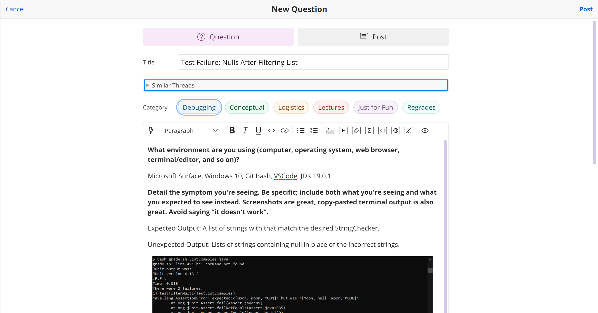
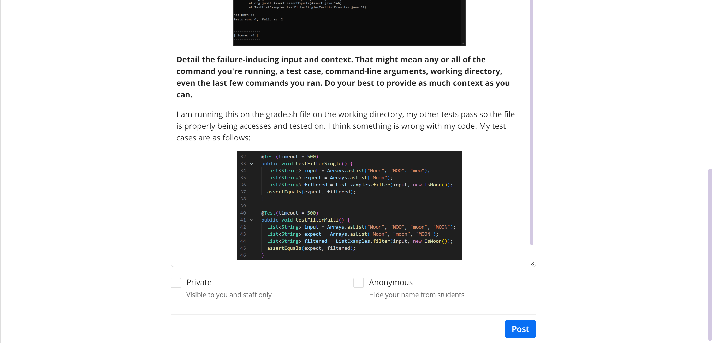
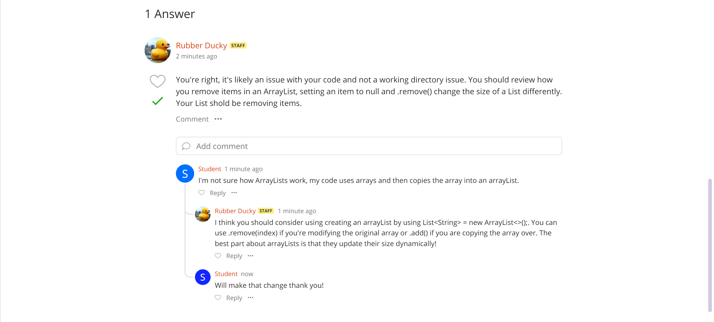

# Lab 5 - Edstem Rubber Ducky Debugging 🦆
1. The original post from a student with a screenshot showing a symptom and a description of a guess at the bug/some sense of what the failure-inducing input is. (Don’t actually make the post; just write the content that would go in such a post)

2. A response from a TA asking a leading question or suggesting a command to try.

3. Another screenshot/terminal output showing what information the student got from trying that, and a clear description of what the bug is.
    - I then changed my implemetation of the filter method to not include nulls in my lists. 
    - 