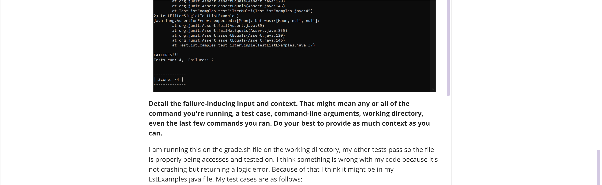

# Lab 5 - Edstem Rubber Ducky Debugging 🦆
## Part 1: Duck TA 🦆 
1. The original post from a student with a screenshot showing a symptom and a description of a guess at the bug/some sense of what the failure-inducing input is. 

2. A response from a TA asking a leading question or suggesting a command to try.

3. Another screenshot/terminal output showing what information the student got from trying that, and a clear description of what the bug is.
    - Changed the implemetation of the filter method to not include nulls in lists by opting to use ArrayLists instead of arrays for dynamic sizing.
    - This bug was caused by the fact that the array was declared as the size of the List but filter returned less matches than the size of list. When filtering out items that did not match StringChecker, the item in the array remained null becuase the array could not be resized to accomadate less items. So when packaged as a List and sent to the user, there would be nulls in place of the non-matching strings.
    - Buggy Code 🐛
        - 
    - Here is an image of the fixed code 🔧
        - 
    - It worked!
        - 

4. At the end, all the information needed about the setup including:
    - The file & directory structure needed
        - Project/
            - lib/
                - hamcrest-core-1.3.jar
                - junit-4.13.2.jar
            - grade.sh
            - ListExamples.java
            - TestListExamples.java   
    - The contents of each file before fixing the bug
        - Buggy Code
        - 
        - A snippet of grade to show what the parameters are doing
        - 
    - The full command line (or lines) you ran to trigger the bug
        - `bash grade.sh ListExamples.java`
    - A description of what to edit to fix the bug
        - Go to `ListExamples.java`
        - Change line 14 to `List<String> result = new ArrayList<>();`
        - Change line 17 to `result.add(list.get(i));`
        - Delete line 20
        - Run `bash grade.sh ListExamples.java`
        - Profit!!!

## Part 2: Reflection
I learned a lot during these lab sections! I am glad to have learned the basiscs of Git and Github, bash scripting, vim, and java web servers. I am really interested in Java web servers I can see a lot of possibilites with having to computers access the same program remotely. I hope Java web servers can support online communication to make fun multiplayer web browser game like a two player snake! More practically, I hope to continue to get used to vim, it will be super helpful moving forward as working with large computing servers becomes more common. These lab sections have been a fun and pressure free way to experiment and learn new tricks for programming!
